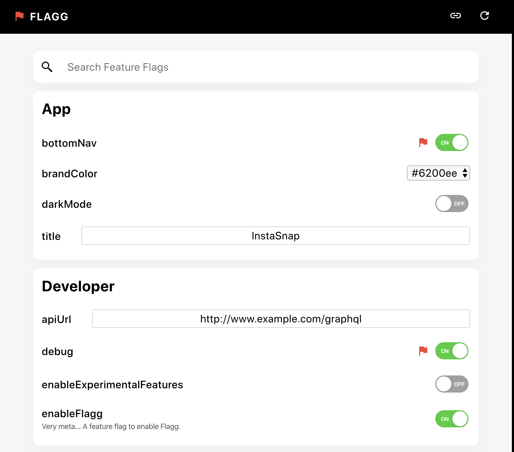

[](https://circleci.com/gh/jamesmfriedman/flagg/tree/master)
[](https://codecov.io/gh/jamesmfriedman/flagg)
[](https://www.npmjs.com/package/flagg)
[](https://github.com/jamesmfriedman/flagg/blob/master/LICENSE)

# Flagg

Declarative Feature Flagging for your Javascript App



Features: 
- 🎉 Framework Agnostic!
- 🚀 Easy to add to your existing codebase
- ⚡️ Out of the box support for Typescript, React, Redux, and Node
- ✅ Includes an admin that you can use with React or Web Components

TOC
- [What For?](#what-for)
- [Get Started](#get-started)
- [Solutions by Use Case](#solutions-by-use-case)
- [Stores](#stores)
- [Security](#security)
- [API](#api)
- [React](#react)
- [Typescript](#typescript)

# What For?

Flagg gives you a simple, declarative, and extensible way to add feature flags to your javascript app. Feature flags (also known as feature toggles or configuration management) allow you to handle a variety of development and deployment use cases that are common when working on production grade apps. Some examples:

- Continuously deploying features that are still in development.
- New feature opt in "Try out the new home experience"
- A / B testing features
- Customer configuration management "Turn on whitelabeling for this client only"
- Allowing CI environments to test multiple codepaths for different sets of configuration
- It's basically chrome://flags for your web app ;)

# Get started

Flagg accepts a definitions list and one or more storage mechanisms for your feature flags. Any call to get or set will look for the feature flag's name in the specified store and return or set the value. It's a simple concept that can have profound implications on how you build and ship your features.

Install it: `npm install flagg` or `yarn add flagg`

```javascript
import {flagg, inMemoryStore} from 'flagg';

// Create your feature flags
const featureFlags = flagg({
  store: inMemoryStore(),
  definitions: {
    'home_enableV2': {
      default: false
    },
    'developer_debugMode': {
      default: process.env.NODE_ENV === 'development'
    },
  }
});

// Use them!
if (featureFlags.get('home_enableV2')) {
  // do something for this feature
}

featureFlags.set('developer_debugMode', true);
```

# Solutions by Use Case

Before you dive deeper into the documentation, here are some common scenarios you'll likely come across and how you can accomplish them with Flagg.

- Use Case: I want to deploy an unfinished feature so I can start testing it
- Solution: Use `sessionStore` and then enable the feature via your dev tools by setting `sessionStorage.setItem('ff_myNewFeature', true)` or by using the Flagg admin panel.

```javascript
import {flagg, sessionStore} from 'flagg';

const featureFlags = flagg({
  store: sessionStore(),
  definitions: {
    'myNewFeature' {default: false}
  }
});
```

- Use Case: I want to allow a user to opt into a new feature
- Solution: Use `localStore` and provide a UI for your users to enable the feature.

```javascript
import {flagg, localStore} from 'flagg';

const featureFlags = flagg({
  store: localStore(),
  definitions: {
    'myNewFeature' {default: false}
  }
});

// somewhere else in your app
<button onclick="featureFlags.set('myNewFeature', true)">
```

- Use Case: I want to A / B test a feature
- Use Case: I want to send links to a user or another developer with feature flags preset
- Solution: Hydrate from a url and then use either `sessionStore` or `localStore` depending on if you want the flags to persist across browsing sessions.

Example Link: https://example.com?ff={"myNewFeature":true}

```javascript
import {flagg, urlStore, sessionStore} from 'flagg';

const featureFlags = flagg({
  store: sessionStore(),
  definitions: {
    'myNewFeature' {default: false}
  }
});

featureFlags.hydrateFrom(urlStore(window.location.search))
```

- Use Case: I want to enable features for a specific customer and lock it down
- Solution: Load some remote configuration and then freeze the store.

```javascript
import {flagg, inMemoryStore} from 'flagg';

const featureFlags = flagg({
  store: inMemoryStore(),
  definitions: {
    'specialCustomerFeature' {default: false}
  }
});

fetch('https://my.customer.configuration')
  .then(res => res.json())
  .then(res => {
    // Assuming res is {"specialCustomerFeature": true}
    featureFlags.set(res);
    featureFlags.freezeAll();
  })
```

- Use Case: I want my CI tool to test multiple code paths based on feature flags.
- Solution: Get your feature flag values using envStore, making sure to prefix them with `ff_`.

```javascript
import {flagg, envStore} from 'flagg';

// Environment variable names cant have dots in them
// Flagg uses an underscore to work around this
process.env['ff_myNewFeature'] = true;

const featureFlags = flagg({
  store: envStore(process.env),
  definitions: {
    'myNewFeature' {default: false}
  }
});
```

# Stores

There are handful of built in storage mechanisms to support a wide range of use cases.

### `inMemoryStore`

A simple key / value store that will be reset on every refresh.

### `localStore`

Saves feature flag settings to localStorage to persist between tabs and browser restarts. All keys in localStorage will be prefixed with `ff_`. Browser only.

### `sessionStore`

Saves feature flag settings to sessionStorage which will only live in the current tab and the current browsing session. All keys in sessionStorage will be prefixed with `ff_`. Browser only.

### `urlStore`: Readonly

Enables reading feature flag settings from a get a parameter or a url search string. Just pass the search string on init. The get paramemter format is the key `ff` pointing to a uri encoded JSON object.

Example: `https://example.com?ff={"home_v2":true}`

```javascript
import {flagg, urlStore} from 'flagg';

const featureFlags = flagg({
  store: urlStore(window.location.search),
  definitions: {...}
});
```

### `envStore`: Readonly
Enables reading feature flag settings from either a client side build's `process.env` variable or Node's process.env. When setting feature flags in the environment you need to prefix them with `ff_`. 

Example `process.env['ff_home_v2']`

```javascript
import {flagg, envStore} from 'flagg';

const featureFlags = flagg({
  store: envStore(process.env),
  definitions: {...}
});
```

### Custom Stores

Don't see one you for you? Follow this guide: [Writing your own custom store](./README_STORE.md).

## Specifying Stores

You can pass multiple stores to the `flagg` init function as well as specify what store a particular definition should use. The first store specified is considered the default.

```javascript
import {flagg, sessionStore, localStore} from 'flagg';

const featureFlags = flagg({
  // Enable both the sessionStore and localStore.
  // sessionStore is the default
  store: [sessionStore(), localStore()],
  definitions: {
    // Tell this feature flag to use localStore which
    // will let it persist between tabs and browser sessions
    'home_enableV2': {
      default: false,
      store: 'localStore'
    },
    // This feature flag will use the default store
    // which is sessionStore
    'developer_debugMode': {
      default: false
    },
  }
});
```

## Feature Flag Hydration

By default, every call to get / set will directly read and write from the specified store. Certain Use Cases such as url or environment based feature flags are more of a "copy on init" than anything else.

For the below example, imagine you want to send an email out with a link to try out the new home experience. The link can contain a feature flag payload, but once the user receives it, you'll want the property to be set in localStorage so that the next time they visit your app, the flag will still be set.

This is exactly what hydrateFrom does for you. It will read all available key / value pairs from the store specified in `hydrateFrom` and set them on what you have specified in `store`.

```javascript
import {flagg, urlStore, localStore} from 'flagg';

const featureFlags = flagg({
  store: localStore(),
  definitions: {
    'home_enableV2': {
      default: false
    }
  }
});
// assuming example url https://example.com?ff={"home_enableV2":true}
featureFlags.hydrateFrom(urlStore(window.location.search))
```

# Security
Using feature flags can have implications for the security of your app (depending on what you have your feature flags actually doing). You should never rely on frontend feature flags alone to lock down your app since client side code can always be tampered with. With that said, it doesn't mean we have to make it easy!

Flagg ships with the ability to freeze feature flags. One they're frozen, they'll be stuck that way until the next browser refresh. The most common scenario that this covers is loading some remote configuration for a customer, setting their flags, and then freezing them. While this may not stave off more advanced attacks,it will absolutely stop the person who knows how to poke around dev tools from settings values to something you don't want them to be. Note that this freezes all calls to `set` from anywhere, including programatically, the admin, etc.

```javascript
import {flagg, inMemoryStore} from 'flagg';

const featureFlags = flagg({
  store: inMemoryStore(),
  definitions: {
    'specialCustomerFeature' {default: false},
    'anotherFeature' {default: false}
  }
});

// freeze an individual
featureFlags.freeze('anotherFeature'); // Freeze it
featureFlags.set('anotherFeature', true); // warning 
featureFlags.get('anotherFeature'); // still false

// Example fetching remote config
fetch('https://my.customer.configuration')
  .then(res => res.json())
  .then(res => {
    // Assuming res is {"specialCustomerFeature": true}
    featureFlags.set(res);
    // freeze everything
    featureFlags.freezeAll();
  })
```

Another basic aspect of security is to make sure you don't include the Flagg admin in your production builds. This can be done in a variety of ways, but the simplest is making sure to only enable it when `process.env.NODE_ENV === 'development'`

# Flagg Admin

Flagg ships with an admin panel (pictured above) for use inside of your app. This is useful in development to pop open and see the entire feature flag surface, as well as make any adjustments you want. It is recommended that you disable this or find ways to secure / hide it on your production apps.

For React: an example embedding the panel at it's own Route, and only in dev mode.

```tsx
import {FlaggAdmin} from 'flagg/react';
import {Route, Switch} from 'react-router';

function App() {
  return (
    <Switch>
      <Route path="/" render={() => <Home />}>
      {process.end.NODE_ENV === 'development' &&
        <Route path="/feature-flags" render={() => <FlaggAdmin />}/>
      }
    </Switch>
  )
}
```

# API

## Constructor

```typescript
flagg({
  /** One or more storage mechanisms for your feature flags. */
  store: Store | Store[];
  /** Feature flag definitions. */
  definitions?: FlagDefinitions;
});
```

## Flag Definitions and FlagValues

A `FlagValue` can be any primitive in javascript. A general rule of thumb is that a feature flag needs to be serializeable at all times, so no functions. 

```typescript
type FlagValuePrimitive = string | boolean | number | null | object;
type FlagValue = FlagValuePrimitive | FlagValuePrimitive[];
```

```typescript
interface FlagDefinition {
  /** An optional description to understand what the feature flag is for. */
  description?: string;
  /** Specify which store this feature flag should use. */
  store?: string;
  /** A default value for your feature flag. */
  default?: FlagValue;
  /** An array of options to present as a dropdown in the admin. */
  options?: string[];
}
```

## Instance
Most of the time you'll only need to use the `set` and `get` methods. The rest of the api surface is useful for higher order tools like the Flagg Admin panel.

```typescript
const ff = flagg(options);
ff.get('myFlag')
```

```typescript
interface FlaggInstance {
  /** Gets a value for a feature flag. */
  get: (flagName: string) => FlagValue;
  
  /** Sets one or many feature flags. */
  set: (flagName: string, value: FlagValue) => void
    | ({[flagName: string]: FlagValue}) => void;

  /** Get the default value for a feature flag. */
  getDefault: (flagName: string) => FlagValue;
  
  /** Checks to see if a feature flag is overridden. */
  isOverridden: (flagName: string) => boolean;
  
  /** Allows you to hydrate from one or more stores. See the docs on Stores. */
  hydrateFrom: (storesToHydrateFrom: Store | Store[]) => void;

  /** Set the definitions after init. */
  setDefinitions: (definitions: FlagDefinitions) => void;
  
  /** Gets the current set  of definitions. */
  getDefinitions: () => FlagDefinitions;
  
  /** Gets all feature flags with their resolved value. */
  getAllResolved: () => {[flagName: string]: FlagValue};
  
  /** Get only the feature flags that are different than their defaults. */
  getAllOverridden: () => {[flagName: string]: FlagValue};

  /** Freeze a feature flag to prevent further changes. */
  freeze: (flagName: string) => void;
  
  /** Freeze all feature flags. */
  freezeAll: () => void;

  /** Resets a feature flag to its default value. */
  reset: (flagName: string) => void;

  /** Reset all feature flags to their default value. */
  resetAll: () => void;

  /** Check if a feature flag is frozen. */
  isFrozen: (flagName: string) => boolean;
}
```

# React
Please see the documentation on React.
[React Documentation](./README_REACT.md)

# Typescript
Please see the documentation on Typescript.
[Typescript Documentation](./README_TYPESCRIPT.md)